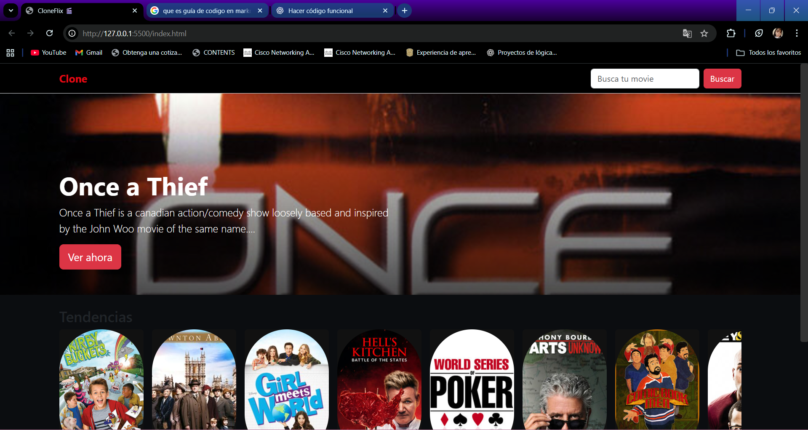

# 🎬 CloneFix — Clon de Netflix

**CloneFix** es un proyecto web inspirado en la interfaz y experiencia de usuario de **Netflix**.  
Su propósito es practicar y aprender desarrollo web mediante la creación de una plataforma de streaming con diseño moderno, interactividad y conexión a una API para obtener contenido dinámico.

---

## 🧾 Tabla de Contenidos

- [Descripción](#descripción)
- [Características principales](#características-principales)
- [Tecnologías utilizadas](#tecnologías-utilizadas)
- [Estructura base del JavaScript](#estructura-base-del-javascript)
- [Renderizado de las secciones](#renderizado-de-las-secciones)
- [Estructura del repositorio](#estructura-del-repositorio)
- [Versiones y ramas](#versiones-y-ramas)
- [Capturas o demo](#capturas-o-demo)
- [Contacto](#contacto)

---

## 🎥 Descripción

El proyecto **CloneFix** busca recrear las principales características visuales y funcionales de **Netflix**, incluyendo:

- Catálogo de películas y series organizado por categorías  
- Diseño responsive (adaptable a distintos tamaños de pantalla)  
- Animaciones y efectos visuales modernos  
- Versión experimental con conexión a una API para mostrar datos reales  

Este proyecto fue desarrollado con fines educativos como parte del aprendizaje en desarrollo **frontend**.

---

## ✨ Características principales

- Página principal con banners e imágenes de películas  
- Interfaz de usuario inspirada en Netflix  
- Menús y secciones interactivas  
- Uso de animaciones en CSS  
- (En versión de desarrollo) Conexión a una API de películas

---

## 🛠️ Tecnologías utilizadas

- **HTML5** — estructura del contenido  
- **CSS3** — estilos, animaciones y diseño responsive  
- **JavaScript (ES6)** — interactividad y manejo de datos  
- **Fetch API / Promesas** — para la versión con conexión a API  
- *(Opcional)* Librerías o frameworks si se agregan más adelante (ej. Bootstrap, React, etc.)

---
## 📁 Estructura base del JavaScript
```// API de TVmaze
const API = "https://api.tvmaze.com";

// Elementos del DOM
const rowsContainer = document.getElementById("rowsContainer");
const hero = document.getElementById("hero");
const heroTitle = document.getElementById("heroTitle");
const heroDesc = document.getElementById("heroDesc");

// Inicialización
const init = async () => {
  try {
    const shows = await getShowsByCategory("popular");
    renderRows(shows);
    renderHero(shows[0]);
  } catch (error) {
    console.error("Error inicializando la app:", error);
  }
};
init();
```
🔹 Explicación:

Se define la constante API con la URL base de TVmaze.

Se obtienen los elementos principales del DOM.

La función init() ejecuta la carga inicial: obtiene datos, crea secciones de películas y muestra una imagen destacada (hero).
---
## 🎞️ Renderizado de las secciones
```
function renderRows(shows) {
  rowsContainer.innerHTML = "";

  shows.forEach(show => {
    const item = document.createElement("div");
    item.classList.add("movie-item");
    item.innerHTML = `
      
      <h4>${show.name}</h4>
    `;
    item.addEventListener("click", () => openModal(show));
    rowsContainer.appendChild(item);
  });
}
```
🔹 Explicación:

Se limpia el contenedor de secciones (rowsContainer).

Por cada elemento (película o serie) recibido de la API:

Se crea un bloque con imagen y título.

Se asigna un evento click para abrir el modal con los detalles del show.
---
## 📦 Obtención de datos desde la API
```
async function getShowsByCategory(category) {
  const response = await fetch(`${API}/shows`);
  const data = await response.json();
  return data.slice(0, 20); // limitar resultados para rendimiento
}
```
🔹 Explicación:

Usa Fetch API para obtener datos dinámicos desde TVmaze.

Convierte la respuesta a JSON.

Retorna un número limitado de resultados (por ejemplo, 20).
---
### 🪟 Modales con detalles
```
function openModal(show) {
  const modal = document.getElementById("modal");
  const modalContent = document.getElementById("modalContent");

  modalContent.innerHTML = `
    <h2>${show.name}</h2>
    
    <p>${show.summary || "Sin descripción disponible."}</p>
  `;

  modal.classList.add("active");
}

document.getElementById("modalClose").addEventListener("click", () => {
  document.getElementById("modal").classList.remove("active");
});
```
---

## 🧩 Estructura del repositorio

```text
CloneFix/
├── css/                  # Hojas de estilo
│   └── estilos.css
├── js/                   # Scripts del proyecto
│   └── main.js
├── img/                  # Imágenes o recursos multimedia
├── index.html            # Página principal
├── instalacion.md        # Guía de instalación (opcional)
└── README.md             # Documentación del proyecto
```

---
## ↩️ Versiones y ramas

Actualmente, el proyecto cuenta con dos ramas principales disponibles en GitHub:

| Rama / Versión             | Descripción                                                                              | Enlace directo                                                                                           |
| -------------------------- | ---------------------------------------------------------------------------------------- | -------------------------------------------------------------------------------------------------------- |
| **`main`**                 | Versión estable del clon de Netflix con estructura completa de frontend.                 | 🔗 [Ver rama main](https://github.com/HadassahGarcia/CloneFix/tree/main)                                 |
| **`develop/conexion-api`** | Versión en desarrollo que implementa conexión a una API para mostrar contenido dinámico. | 🔗 [Ver rama develop/conexion-api](https://github.com/HadassahGarcia/CloneFix/tree/develop/conexion-api) |

---
## 📸 Capturas o demo
 
 

---
## 💬 Contacto

Autora: Hadassah García
📫 GitHub: @HadassahGarcia

🌐 Proyecto: CloneFix